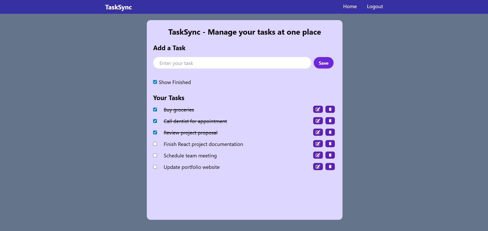

# TaskSync 📝

**TaskSync** is a clean and responsive task management app built with **React**, **Vite**, and **Tailwind CSS**. It helps users manage daily tasks efficiently with features like add/edit/delete, completion tracking, and localStorage persistence — all wrapped in a user-friendly interface.

---

## 🌐 Live Demo

[Live Demo](https://tasksync-todolist.vercel.app)

---

## 📸 Screenshots


 
---

## 🚀 Features

- ✅ Add new tasks with a single click 
- ✅ Edit existing tasks
- ✅ Delete tasks you no longer need
- ✅ Mark tasks as finished or unfinished
- ✅ Toggle visibility of completed tasks
- ✅ Persistent task list using browser localStorage
- ✅ Responsive layout for desktop and mobile

---

## 🛠️ Built With

- [React](https://reactjs.org/)
- [Vite](https://vitejs.dev/)
- [Tailwind CSS](https://tailwindcss.com/)
- [React Icons](https://react-icons.github.io/react-icons/)
- [UUID](https://www.npmjs.com/package/uuid)

---

## 📦 Installation & Setup

```bash
# Clone the repository
git clone https://github.com/SahityaNaik/TaskSync-TodoList
cd TaskSync-TodoList

# Install dependencies
npm install

# Start development server
npm run dev
